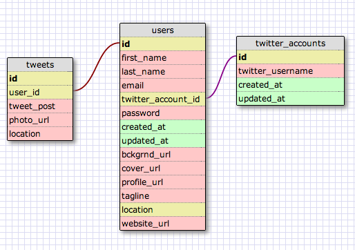

# U3.W7: Modeling a Real-World Database (SOLO CHALLENGE)

## Release 0: Users Fields
Name
Twitter handle
Email
Password
Background photo
Cover photo
Profile photo
Tagline
Location
Website
Created Date
Updated

## Release 1: Tweet Fields
Tweet
Photo
Location
Created Date

## Release 2: Explain the relationship
The relationship between `users` and `tweets` is: 
one to many because you can have a number of tweets for one account

## Release 3: Schema Design

## Release 4: SQL Statements
all the tweets for a certain user id
  SELECT tweet_post FROM tweets
the tweets for a certain user id that were made after last Wednesday (whenever last Wednesday was for you)
  SELECT tweet_post FROM tweets WHERE created_at BETWEEN 05/14/2014 AND 05/18/2014
all the tweets associated with a given user's twitter handle
  SELECT tweet_post FROM tweets WHERE 
the twitter handle associated with a given tweet id
  SELECT twitter_account_id FROM users

## Release 5: Reflection
<!-- Be sure to add your reflection here!!! -->
